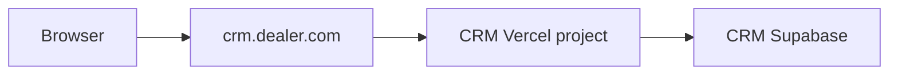
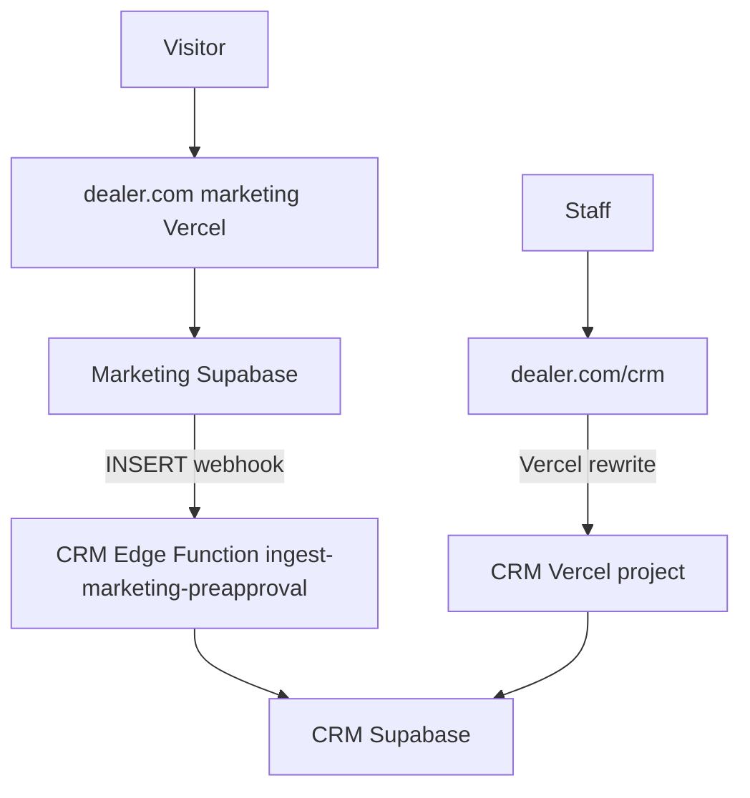

# Deployment topologies

How to expose the CRM (`VITE_PRODUCT=crm`, `npm run build:crm`) on the public internet. The CRM app always uses internal routes at **`/crm`**. How that maps to the browser URL depends on the topology.

See also: [PROVISIONING.md](PROVISIONING.md), [CRM_BRIDGE.md](CRM_BRIDGE.md), [SETUP_CHECKLIST.md](SETUP_CHECKLIST.md).

---

## Build modes (one Git repo)

| `VITE_PRODUCT` | Build | Routes | Use case |
|------------------|-------|--------|----------|
| `crm` | `npm run build:crm` | `/crm` ( `/` redirects to `/crm` ) | **Default** — licensees, playground, your prod CRM |
| `finance` | `npm run build:finance` | `/` finance; `/crm` redirects to `VITE_CRM_APP_URL` | Optional standalone finance tool |
| `full` | `npm run build` | `/` finance + `/crm` CRM | Legacy local dev only (`npm run dev:full`) |

Finance code stays in the repo; CRM deploys do not bundle the finance dashboard.

---

## Topology A — CRM subdomain (most common)

**Public URL:** `https://crm.dealer.com/crm` (or `https://crm.dealer.com` → redirects to `/crm`)

**Stack:** one Supabase (CRM) + one Vercel (CRM) + optional Twilio



**Vercel env:**

```
VITE_PRODUCT=crm
VITE_SUPABASE_URL=...
VITE_SUPABASE_ANON_KEY=...
```

**Supabase Auth → Site URL:** `https://crm.dealer.com`

**When to use:** dealer has their own marketing site elsewhere, or CRM-only install.

---

## Topology B — Customer owns website; we host CRM only

Same as **Topology A**. Their website links to `https://crm.dealer.com/crm`. No code coupling required.

Optional later: their form POSTs to your CRM edge function (custom integration) instead of the standard marketing bridge.

---

## Topology C — Website + lead funnel + CRM on one domain

**Public URLs:**

- `https://dealer.com` — marketing site (pre-approval funnel)
- `https://dealer.com/crm` — CRM (staff login)

**Stack:** two Supabase projects (marketing + CRM) + two Vercel projects + CRM_BRIDGE webhook



### C1. CRM Vercel project

Same as Topology A. Deploy to `dealer-crm.vercel.app`. Custom domain optional (`crm.dealer.com`) for direct access; staff can also use `dealer.com/crm` via rewrites.

### C2. Marketing Vercel project

Owns **`dealer.com`**. Env from `site/.env.local` pattern in [SETUP_CHECKLIST.md](SETUP_CHECKLIST.md):

```
VITE_SUPABASE_URL=<marketing supabase>
VITE_SUPABASE_ANON_KEY=<marketing anon>
VITE_SITE_MARKETING_ONLY=true
VITE_CRM_APP_URL=/crm
```

Add **`vercel.json`** on the marketing project to proxy CRM paths to the CRM deployment:

```json
{
  "rewrites": [
    {
      "source": "/crm",
      "destination": "https://DEALER-CRM-PROJECT.vercel.app/crm"
    },
    {
      "source": "/crm/:path*",
      "destination": "https://DEALER-CRM-PROJECT.vercel.app/crm/:path*"
    }
  ]
}
```

Replace `DEALER-CRM-PROJECT.vercel.app` with the CRM Vercel production hostname.

### C3. Lead funnel (marketing → CRM)

On **marketing** Supabase:

1. Run `sql/crm_public_preapproval_leads_marketing_project.sql` (or `site/sql/marketing/*` in the site repo).
2. Add database webhook on `preapproval_leads` INSERT → CRM `ingest-marketing-preapproval` URL.

On **CRM** Supabase:

1. Run `sql/crm_marketing_ingest_bridge.sql`.
2. Deploy edge function `ingest-marketing-preapproval`.
3. Set `MARKETING_WEBHOOK_SECRET` (same value on both sides).

Full steps: [CRM_BRIDGE.md](CRM_BRIDGE.md) and `site/docs/CRM_BRIDGE.md`.

### C4. Supabase Auth URLs (CRM project)

Add **both** if using rewrites:

- `https://dealer.com/crm`
- `https://crm.dealer.com` (if also attached)
- `http://localhost:5173/**` for local dev

---

## Temptation (your prod) — recommended first cutover

**Phase 1 (now):** Topology A only

| App | Domain | Build |
|-----|--------|-------|
| CRM | `crm.sharifian.cfd` | `build:crm` |
| Finance | deferred | — |
| Marketing | existing site project | unchanged |

**Phase 2 (later):** add finance Vercel with `build:finance` + `VITE_CRM_APP_URL=https://crm.sharifian.cfd/crm`

Step-by-step: [TEMPTATION_CUTOVER.md](TEMPTATION_CUTOVER.md)

---

## Local development

| Command | Mode | Open |
|---------|------|------|
| `npm run dev` or `npm run dev:crm` | CRM | http://localhost:5173/crm |
| `npm run dev:finance` | Finance | http://localhost:5173 |
| `npm run dev:full` | Combined | http://localhost:5173 |

Setup helpers:

- Playground: `.\scripts\New-PlaygroundEnv.ps1` (uses playground Supabase)
- Finance: `.\scripts\New-FinanceEnv.ps1` (see `.env.finance.example`)

---

## Per-tenant checklist (quick)

| Step | CRM subdomain | Website + `/crm` |
|------|---------------|------------------|
| Supabase CRM + migrations | Yes | Yes |
| Supabase marketing | No | Yes |
| Vercel CRM (`build:crm`) | Yes | Yes |
| Vercel marketing | No | Yes |
| `vercel.json` rewrites on marketing | No | Yes |
| CRM_BRIDGE webhook | Optional | Yes (for funnel) |
| `seed_tenant_defaults.sql` + branding PNGs | New installs | New installs |

---

## Related

- [PROVISIONING.md](PROVISIONING.md) — new licensee end-to-end
- [CLOUD_SETUP.md](CLOUD_SETUP.md) — playground + Temptation split
- [MIGRATIONS.md](MIGRATIONS.md) — SQL order
