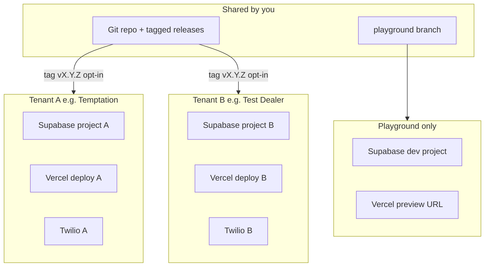

# White-Label CRM Licensing Plan

Internal reference for licensing the CRM to independent dealerships. **Model A:** one isolated stack per tenant (Supabase + Vercel + Twilio). This document is planning and operations guidance only; it does not change runtime behavior.

---

## Goal and product boundary

- License **CRM only** (`/crm`) — exclude the finance dashboard (`FinanceDashboardPage`, `/` route, lender CSV, calculator).
- **Temptation / sharifian.cfd CRM** is **tenant #1** on the same release channel as licensees.
- Each licensee gets physically separate data: customers, leads, calls, texts, recordings, branding, users.

**Not in v1:** single-database multi-tenant (`org_id` on all tables). The current `crm_org_settings` single row (`id = 'default'`) stays as-is until a deliberate later project.

---

## Architecture (Model A — one stack per tenant)

### Per tenant

| Component | Purpose |
|-----------|---------|
| Supabase project | DB, Auth, Storage, Edge Functions |
| Vercel project | SPA deploy + custom domain |
| Twilio | Phone number + account secrets |
| VAPID keys | Web push (inbound SMS/call alerts only) |

### Shared (one codebase)

- Git repo and tagged releases
- SQL migration files in `sql/`
- Edge function **source** (deployed separately per Supabase project)

### Why Model A

- Physical data isolation (licensing-friendly, simpler compliance story)
- Minimal RLS refactor vs multi-tenant
- Matches current single-org `crm_org_settings` design
- One tenant’s bad migration does not take down others

---

## Control plane (start manual)

Track tenants in a spreadsheet or future `tenants.json`. No control-plane app in v1.

| Field | Example |
|-------|---------|
| `tenant_id` | `temptation` |
| `name` | Temptation Motorsports |
| `supabase_project_ref` | `abcdefghij` |
| `vercel_project_id` | `prj_...` |
| `domain` | `crm.sharifian.cfd` |
| `twilio_phone` | `+1...` |
| `current_version` | `v1.0.0` |
| `target_version` | `v1.1.0` |
| `status` | `active` / `playground` / `suspended` |

---

## Environments

| Environment | Git | Supabase | Vercel |
|-------------|-----|----------|--------|
| **Playground** | `playground` or `develop` branch | Dedicated dev project | Preview URL (e.g. `playground-crm.vercel.app`) |
| **Staging** (optional) | `main` pre-tag | Staging project | `staging-crm.*` |
| **Production** (per tenant) | Git tag `vX.Y.Z` | That tenant’s prod project | That tenant’s prod project |

### Hard rules

- **Playground never connects to production Supabase.**
- SQL migrations: test on playground DB first, then run per tenant on upgrade.
- Production deploys only from **git tags**, not arbitrary branch heads.

---

## Release and opt-in upgrades

The app is a static SPA — “opt-in update” means deploying a new frontend version plus any pending SQL migrations when the tenant is ready.

1. Develop on `playground` branch → playground Supabase + Vercel preview.
2. Merge to `main` → tag `vX.Y.Z` → update `CHANGELOG.md`.
3. Maintain an ordered **migration manifest** (list of `sql/*.sql` files with the version they were introduced).
4. Per tenant (manual runbook first):
   - Run pending SQL against that tenant’s Supabase.
   - Redeploy their Vercel project at the target git tag.
   - Update `current_version` in the control plane.
5. **Future:** `app_version` in `crm_org_settings` + Settings UI (“Update available” / release notes).

Early ops: email the tenant and schedule upgrades. Automate (Vercel API + Supabase CLI) when you have 3+ tenants.

---

## White-label checklist (phased)

### Phase 0 — Neutral product shell

- [ ] CRM-only build via `VITE_PRODUCT=crm` (default on existing deploy stays unchanged until flipped per project)
- [ ] Neutral fallbacks: `src/utils/crmHeaderCopy.ts`, `src/assets/`, `index.html`, `public/manifest.webmanifest`
- [ ] Footer (`src/pages/CrmPage.tsx`) and `document.title` (`src/App.tsx`) driven from `crm_org_settings` when implemented
- [ ] SQL defaults in `sql/crm_org_settings_header_copy.sql` — affects **new** tenants only; existing DBs unchanged
- [ ] Optional: dynamic PWA manifest / theme-color from org accent

### Phase 1 — Tenant provisioning

- [ ] `docs/PROVISIONING.md` runbook
- [ ] New Supabase project → run all `sql/` in documented order
- [ ] Storage buckets: `crm-branding`, call recordings (see existing SQL)
- [ ] Deploy edge functions + secrets (`TWILIO_*`, `VAPID_*`)
- [ ] Vercel project + env (`VITE_SUPABASE_URL`, `VITE_SUPABASE_ANON_KEY`, `VITE_VAPID_PUBLIC_KEY`)
- [ ] Custom domain + SSL
- [ ] Twilio number → webhooks to **that** tenant’s edge functions
- [ ] First master user + `crm_access_allowlist` / `app_metadata`
- [ ] Branding via Settings (logo, title, accent)

### Phase 2 — Playground

- [ ] Dedicated playground Supabase (empty, same schema as prod)
- [ ] Vercel preview deploy from `playground` branch
- [ ] Seed script for fake customers/leads (no real PII)
- [ ] Document: playground ≠ any prod DB

### Phase 3 — Release pipeline

- [ ] Protect `main` branch
- [ ] Tag every release `v*.*.*`
- [ ] `CHANGELOG.md` + `sql/MIGRATIONS.md` (ordered manifest)
- [ ] Upgrade script outline: tenant + target version → SQL + Vercel deploy
- [ ] Temptation prod on same tag channel as licensees

### Phase 4 — Licensee UX

- [ ] Settings → About / software version
- [ ] “Update available” + release notes (read-only until apply)
- [ ] License / terms page (legal review)

### Phase 5 — Control plane (3+ tenants)

- [ ] Internal tenant registry UI or CLI
- [ ] Vercel deploy API (redeploy at git ref)
- [ ] Optional: Stripe billing

---

## What is already DB-driven vs hardcoded

### Configurable in CRM Settings (per tenant, no redeploy)

- Header title and subtitle (`crm_org_settings`)
- Accent color, light/dark mode, control styles, label colors
- Logo and background PNGs (Supabase Storage `crm-branding`)
- Pipeline stages, directory groups, permissions, lenders
- Inbound fallback phone, recording disclosure text
- All operational CRM data

### Hardcoded today (change per licensed product or in Phase 0)

- `index.html`, `public/manifest.webmanifest`, PWA icons — Temptation naming
- Default fallbacks in `crmHeaderCopy.ts`, bundled `logo.png` / `Tlogo.png`
- CRM footer: “© … Tempt CRM” in `CrmPage.tsx`
- `document.title` in `App.tsx` for `/crm`
- SQL **defaults** on new installs (`Temptation Motorsports CRM`)
- CSS variable prefix `--tempt-*` (cosmetic; accent overridden at runtime)

### Infrastructure per tenant (not in app code)

- `VITE_SUPABASE_*`, Twilio secrets, VAPID keys, domain

---

## Cost model (per tenant, monthly USD ballpark)

| Profile | Users | Texts/mo | Call min/mo | Infra/mo |
|---------|-------|----------|-------------|----------|
| **Small** | 3–8 | 200–800 | 100–400 | $35–80 |
| **Regular** | 8–20 | 1k–3k | 400–1.2k | $60–150 |
| **Heavy** | 20+ | 5k+ | 2k+ | $150–350+ |

- **Supabase Pro:** ~$25/tenant (required beyond 2 free projects per org)
- **Twilio:** main variable — pass through or bundle with caps
- **Vercel:** static SPA usually $0–20/tenant

**Pricing suggestion:** $99–199/mo software license + Twilio at cost or fair-use bundle; avoid eating unlimited Twilio usage.

### Free vs paid when starting

| Free | Paid soon |
|------|-----------|
| 2 Supabase projects (playground + your CRM) | 3rd+ tenant = Supabase Pro each |
| Vercel Hobby (dev/demo) | Vercel Pro for commercial licensing |
| Git, self-hosted VAPID | Twilio per tenant (always) |
| | Custom domains ~$10–15/yr |

---

## Safety rules (do not break live)

1. **Docs-only changes** do not affect production.
2. **Feature flags / env defaults:** existing Temptation Vercel project keeps current behavior until you intentionally set `VITE_PRODUCT` or deploy a CRM-only project.
3. **Branches:** `playground` for experiments; `main` = release-ready; prod from tags only.
4. **Migrations:** playground DB first; backup before prod SQL; never run experimental SQL on Temptation prod casually.
5. **CRM-only build:** use a **separate** Vercel project for licensees, or a build flag — Temptation can keep finance + CRM on one deploy until cutover.
6. **No shared Twilio number** across tenants.
7. **Do not auto-upgrade** tenants without notice; opt-in per tenant.
8. **Do not share** Supabase service role keys with tenants.

---

## Additional recommendations

### Legal and compliance

- MSA + DPA per licensee (you are often a data processor; they own customer PII).
- SMS: CASL (Canada) / A2P 10DLC (US) as applicable; consent is the dealer’s responsibility but document it.
- Call recording: disclosure text in `crm_org_settings` — confirm sufficiency per province/state with counsel.

### Technical

- **`app_version` in `crm_org_settings`** for upgrade UI (future).
- **Backups:** Supabase PITR on Pro; document restore per tenant.
- **Monitoring:** error tracking with tenant tag; Twilio error logs.
- **Onboarding checklist** for new masters: logo, fallback phone, invite team, test inbound SMS/call.
- **Offboarding:** export customers, delete Supabase project, release Twilio number, remove Vercel project.

### Business

- **Twilio:** prefer dealer-owned Twilio accounts when possible (cleaner compliance and offboarding).
- **Domains:** `dealer.yourcrm.com` is fastest; custom `crm.dealer.com` is better white-label.
- **Billing:** manual invoice until 2–3 paying tenants; Stripe later.
- **Pilot:** one friendly small dealer before productizing provisioning.

---

## Suggested timeline (first 4 weeks)

| Week | Focus |
|------|--------|
| 1 | Phase 0 (neutral shell + CRM-only flag) + playground Supabase/Vercel |
| 2 | `PROVISIONING.md` + provision “Test Dealer” tenant |
| 3 | Version tags + Temptation on tag channel + `app_version` sketch |
| 4 | First pilot licensee (small dealer) + pricing + support process |

---

## Success criteria

- [ ] Two isolated prod tenants (Temptation + Test Dealer) on the same git tag
- [ ] Playground deploy cannot touch prod data
- [ ] Documented upgrade from v1.0 → v1.1 executed once on Test Dealer
- [ ] CRM-only build has no finance dashboard routes (when Phase 0 ships)
- [ ] New tenant provisioned in under 2 hours following runbook

---

## Explicitly deferred (not part of doc-only step)

- `VITE_PRODUCT` build flag
- Route changes in `src/App.tsx`
- SQL or branding code changes
- New Vercel/Supabase projects
- `tenants.json` or provisioning scripts

Approve and execute subsequent phases one at a time.

---

## Related docs

- `docs/TWILIO_VOICE.md` — voice setup per Supabase project
- `.env.example` — env vars and SQL migration index
- `sql/crm_org_settings*.sql` — branding and org config schema
